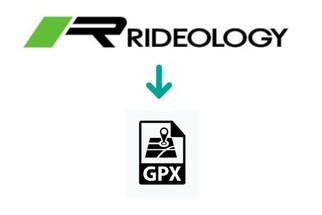
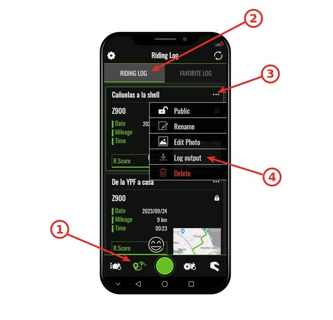

# **$ rideology2gpx**

A simple command line program to transform log files obtained with the *Kawasaki Rideology App* into `.gpx` files.



## Refrences

* [Source code in Github](https://github.com/jbokser/rideology2gpx)
* [Package from Python package index (PyPI)](https://pypi.org/project/rideology2gpx)


## Requirements

* Python 3.6+


## Installation


### From the Python package index (PyPI)

Run:

```shell
$ pip3 install rideology2gpx
```


### From source

Download from [Github](https://github.com/jbokser/rideology2gpx)

Standing inside the folder, run:

```shell
$ pip3 install -r requirements.txt
```

For install the dependencies and then run:

```shell
$ pip3 install .
```


## Usage

```shell
user@host:~/tmp/rideology2gpx$ rideology2gpx --help
Usage: rideology2gpx [OPTIONS] [CSV_FILE] [OUTPUT_DIR]

  A simple command line program to transform log files obtained with the
  Kawasaki Rideology App into GPX files.

  CSV_FILE - File obtained with the Kawasaki Rideology App.
  OUTPUT_DIR - Optional output directory where the files will be created.

  For more info: https://github.com/jbokser/rideolgy2gpx
  Author: Juan S. Bokser <juan.bokser@gmail.com> 
  Version: 1.1b

Options:
  -v, --version                   Show version and exit.
  -d, --date [%Y-%m-%d %H:%M:%S]  Starting datetime for the track in the GPX
                                  files.
  -f, --filter FILTER             Filter applied to waypoints.
  -g, --graph                     Make graphs and md report.
  -h, --help                      Show this message and exit.

  The valid values ​for FILTER are:
    from-0-to-100-kmh          from-20-to-120-kmh  from-100-to-200-kmh
    from-0-to-top-speed        chop-1km-at-end     chop-1km-at-start
    chop-1km-at-start-and-end  chop-3km-at-end     chop-3km-at-start
    chop-3km-at-start-and-end
user@host:~/tmp/rideology2gpx$ rideology2gpx example/ride.csv -d "1979-08-09 09:25:00"
Make file 'example/ride.gpx'... Ok
Make file 'example/ride_gear_shifts.gpx'... Ok
Make file 'example/ride_speed_shifts.gpx'... Ok
Make file 'example/ride_report.txt'... Ok

From gas station to next gas station
==== === ======= == ==== === =======
    
Max engine speed:  3846 rpm
Max wheel speed:   60 km/h
Max water temp:    101 ℃
Avg idle speed:    1202 rpm
Avg speed:         30 km/h
Total time:        0:07:49
Distance:          1.87 km
Starting point:    S034°30′29.52″ E058°28′46.70″
Ending point:      S034°29′53.65″ E058°29′02.93″

Max for each gear
--- --- ---- ----

  Gear    rpm    km/h
     1   3137      29
     2   3611      45
     3   3784      58
     4   3846      60

user@host:~/tmp/rideology2gpx$ 
```


## Why? (The rationale behind this)

Mainly used by [me](https://github.com/jbokser) to get info from my bike.


## Obtain the log files from *Kawasaki Rideology App*


 


## Author

[Juan S. Bokser](https://github.com/jbokser) <juan.bokser@gmail.com>
