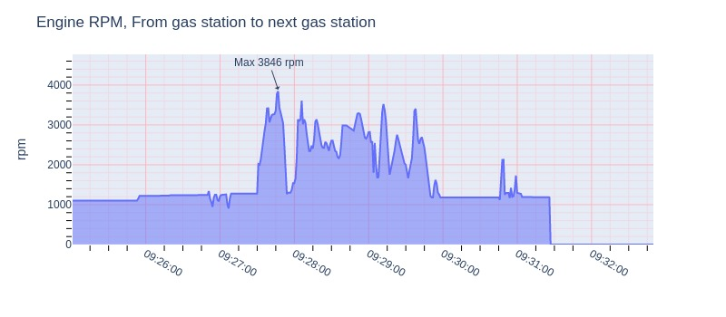
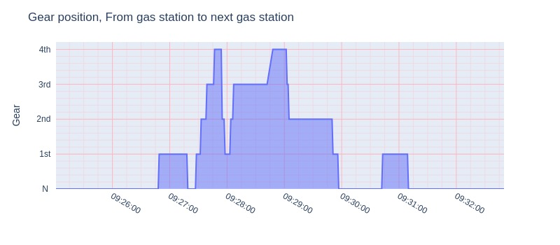

# From gas station to next gas station

| Item             | Value                         |
|------------------|-------------------------------|
| Max engine speed | 3846 rpm                      |
| Max wheel speed  | 60 km/h                       |
| Max water temp   | 101 ℃                         |
| Avg idle speed   | 1202 rpm                      |
| Avg speed        | 30 km/h                       |
| Total time       | 0:07:49                       |
| Distance         | 1.87 km                       |
| Starting point   | S034°30′29.52″ E058°28′46.70″ |
| Ending point     | S034°29′53.65″ E058°29′02.93″ |

## Max for each gear

|   Gear |   rpm |   km/h |
| :----: | ----: | -----: |
|      1 |  3137 |     29 |
|      2 |  3611 |     45 |
|      3 |  3784 |     58 |
|      4 |  3846 |     60 |

## Graphics

 
 
 

